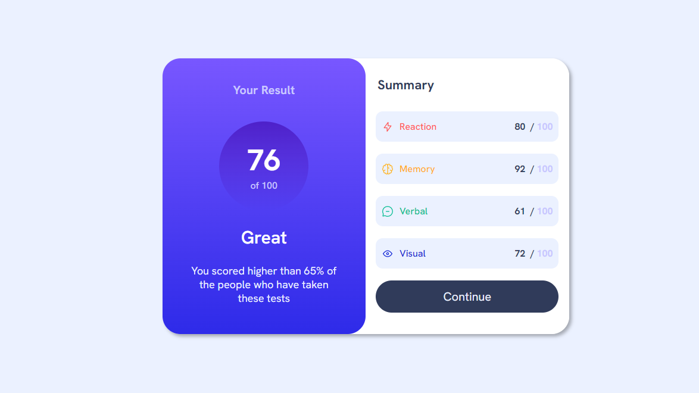
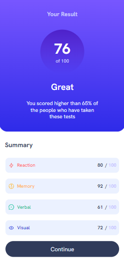

# Frontend Mentor - Results summary component solution

Challenge #1<br>
As a beginner starting my first ever React project, it's an exciting opportunity to apply my newly acquired skills and knowledge to build a web application using one of the most popular and in-demand JavaScript libraries today. 

## Table of contents

- [Overview](#overview)
  - [The challenge](#the-challenge)
  - [Screenshot](#preview)
- [My process](#my-process)
  - [Built with](#built-with)
  - [What I learned](#what-i-learned)
- [Author](#author)

## Overview

### The challenge

Users should be able to:

- View the optimal layout for the interface depending on their device's screen size
- See hover and focus states for all interactive elements on the page

### Preview

Desktop View of the UI Design


Mobile View of the UI Design<br>



## My process

### Built with

- ReactJS
- CSS custom properties
- Flexbox
- [React](https://reactjs.org/) - JS library
- [Google Fonts](https://fonts.google.com/) - For styles


### What I learned

As a beginner, I have gained a solid understanding of the fundamental concepts of ReactJS, including components, JSX syntax.

Below syntax are the things I found interesting learning
```js
function someRandomFunction(){
  return (
    <div>Learned about functions, import export and many more<div>
  )
}
```
```css
@font-face{
    font-family : Hanken;
    src : url(./assets/fonts/Hanken.ttf);
}
```
```js
ReactDom.createRoot(document.getElementById('root')).render(<App />);
```

## Author

- Frontend Mentor - [@Kushalshakya](https://www.frontendmentor.io/profile/Kushalshakya)
